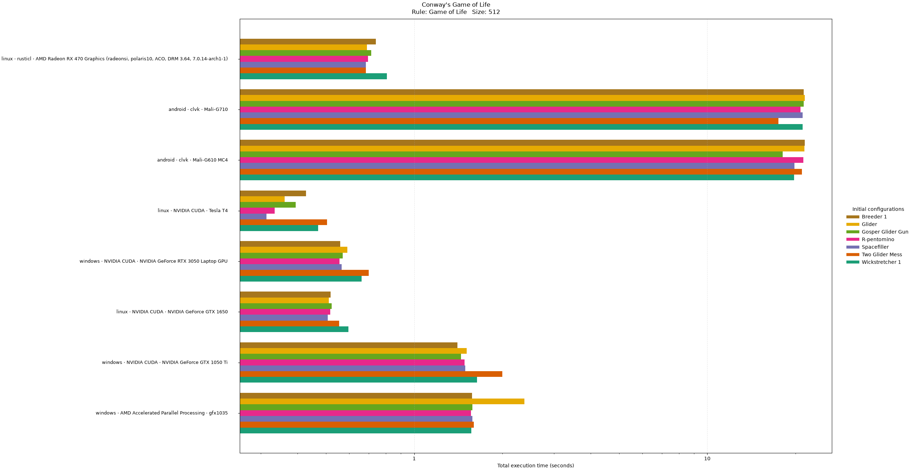
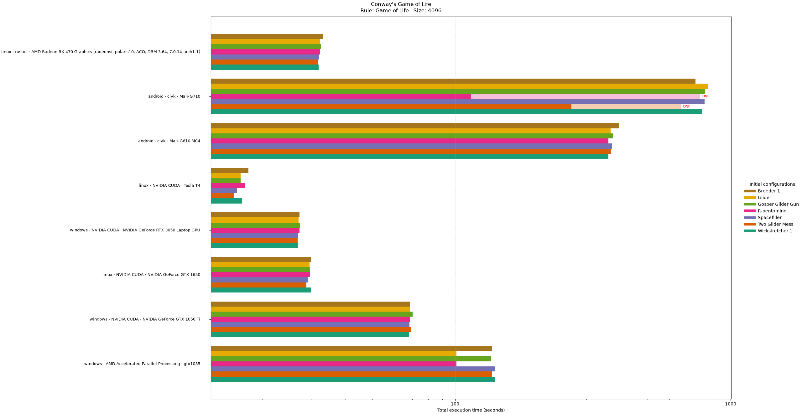
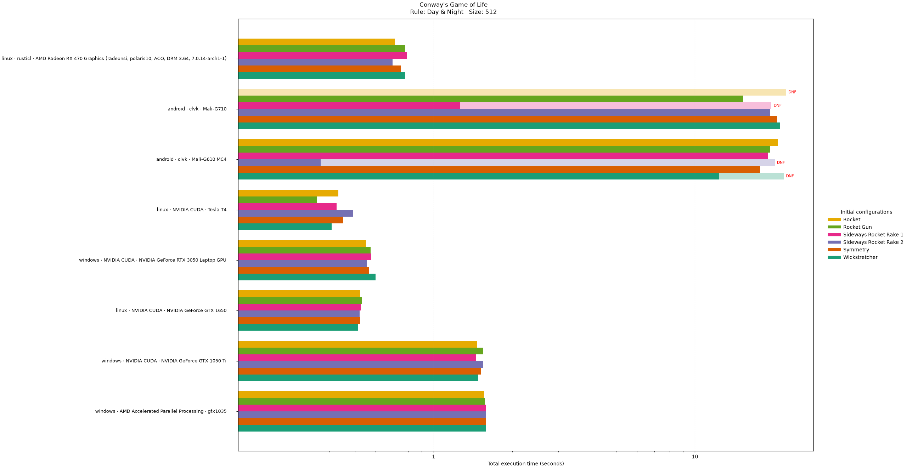
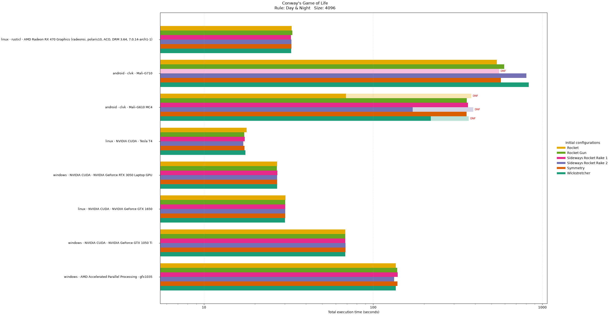
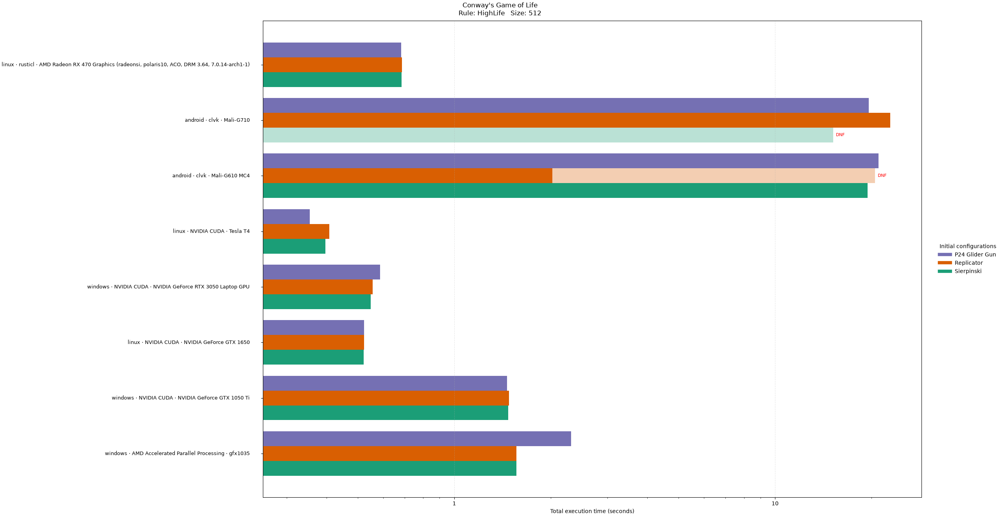
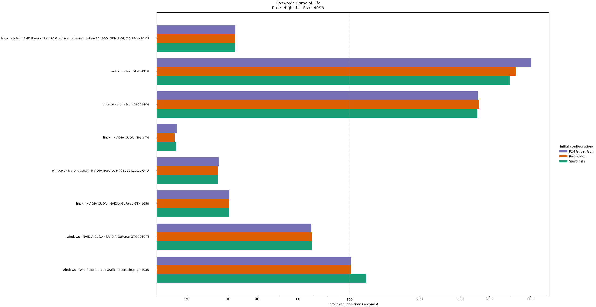
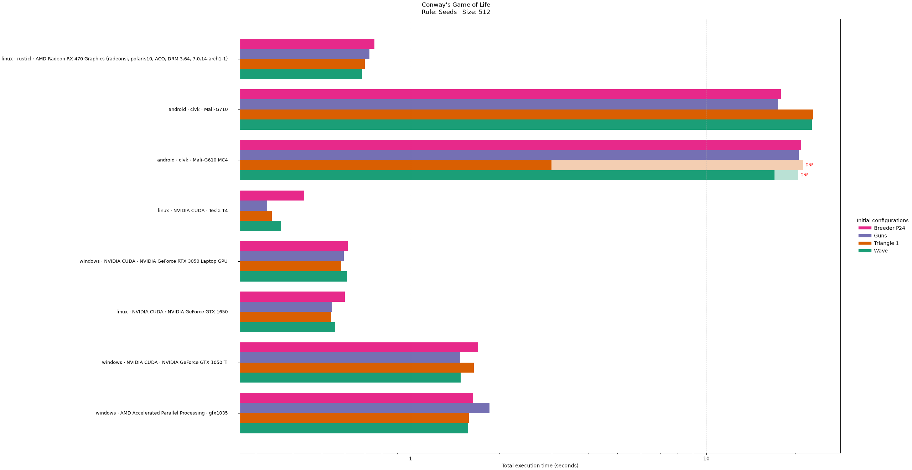
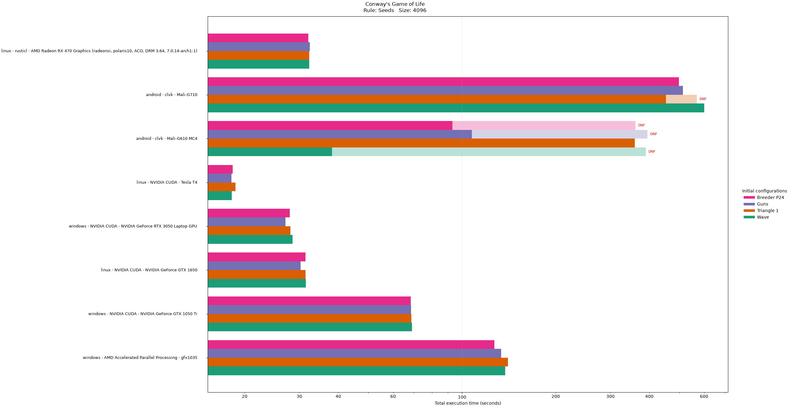
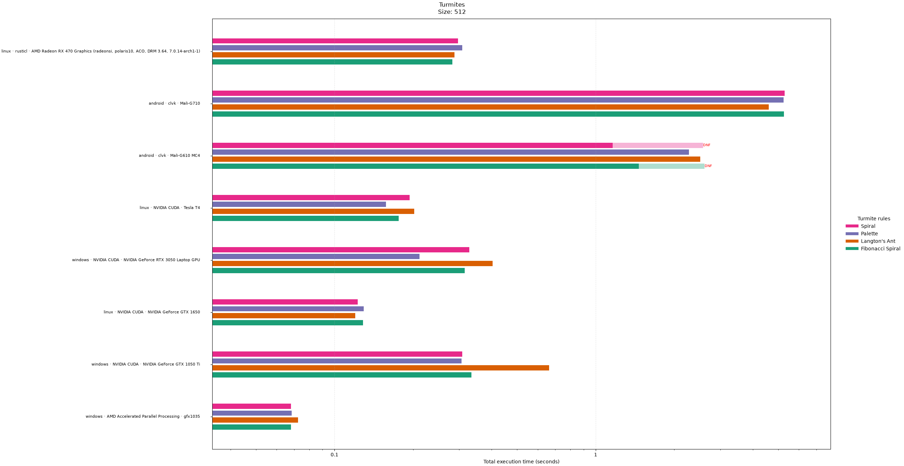
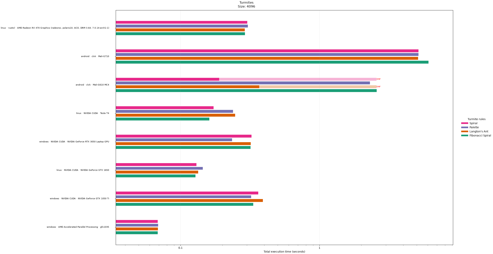

# Cellular automata simulation

## Conway's Game of Life

For each generation, the Game of Life kernel runs for every cell, updating its state based on the supplied rules. Because I started working on this assignment kinda late, I couldn't spend much time optimizing the kernel.

### Performance analysis

I have evaluated the performance of both Life-like and Turmite simulations on multiple operating systems and GPU hardware. However, trying to test Life-like simulations on CPUs would have taken way too long.

The total time it takes to simulate 32768 generations can be seen on the figures below. If a test failed (commonly occurring with Android devices), the data has been extrapolated to 32768 generations with a dimmer color. Only the kernel execution time is measured (not buffer writes), and measured as the difference between `CL_PROFILING_COMMAND_END` and `CL_PROFILING_COMMAND_START`.

The time it takes to simulate this many generations remains mostly consistent per device, with slight variations and a few outliers, and doesn't vary much with the used Life-like rule.

As expected, Android GPUs don't even compare to desktop and Laptop GPUs. In some test cases the NVIDIA Tesla T4 on Google Colab has a very high variance.

For small simulation size, a newer integrated GPU is as fast as an old desktop GPU. A newer dedicated laptop GPU barely beats older desktop GPUs. A datacenter GPU absolutely dominates the chart.

















## Turmites

The turmite kernel is a single-thread kernel. For each generation, it runs for the cell the turmite is in, and updates its state according to the rules. To prove that I understand Turmites, I have created one myself:

```text
{{{1, 4, 1}, {2, 1, 0}, {3, 1, 0}, {4, 1, 0}, {5, 1, 0}, {6, 1, 0}, {7, 1, 0}, {8, 1, 0}, {9, 1, 0}, {10, 1, 0}, {11, 1, 0}, {12, 1, 0}, {13, 1, 0}, {14, 1, 0}, {15, 1, 0}, {16, 1, 0}, {17, 1, 0}, {18, 1, 0}, {19, 1, 0}, {20, 1, 0}, {21, 1, 0}, {22, 1, 0}, {23, 1, 0}, {24, 1, 0}, {25, 1, 0}, {26, 1, 0}, {27, 1, 0}, {28, 1, 0}, {29, 1, 0}, {30, 1, 0}, {31, 1, 0}, {32, 1, 0}, {33, 1, 0}, {34, 1, 0}, {35, 1, 0}, {36, 1, 0}, {37, 1, 0}, {38, 1, 0}, {39, 1, 0}, {40, 1, 0}, {41, 1, 0}, {42, 1, 0}, {43, 1, 0}, {44, 1, 0}, {45, 1, 0}, {46, 1, 0}, {47, 1, 0}, {48, 1, 0}, {49, 1, 0}, {50, 1, 0}, {51, 1, 0}, {52, 1, 0}, {53, 1, 0}, {54, 1, 0}, {55, 1, 0}, {56, 1, 0}, {57, 1, 0}, {58, 1, 0}, {59, 1, 0}, {60, 1, 0}, {61, 1, 0}, {62, 1, 0}, {63, 1, 0}, {64, 1, 0}, {65, 1, 0}, {66, 1, 0}, {67, 1, 0}, {68, 1, 0}, {69, 1, 0}, {70, 1, 0}, {71, 1, 0}, {72, 1, 0}, {73, 1, 0}, {74, 1, 0}, {75, 1, 0}, {76, 1, 0}, {77, 1, 0}, {78, 1, 0}, {79, 1, 0}, {80, 1, 0}, {81, 1, 0}, {82, 1, 0}, {83, 1, 0}, {84, 1, 0}, {85, 1, 0}, {86, 1, 0}, {87, 1, 0}, {88, 1, 0}, {89, 1, 0}, {90, 1, 0}, {91, 1, 0}, {92, 1, 0}, {93, 1, 0}, {94, 1, 0}, {95, 1, 0}, {96, 1, 0}, {97, 1, 0}, {98, 1, 0}, {99, 1, 0}, {100, 1, 0}, {101, 1, 0}, {102, 1, 0}, {103, 1, 0}, {104, 1, 0}, {105, 1, 0}, {106, 1, 0}, {107, 1, 0}, {108, 1, 0}, {109, 1, 0}, {110, 1, 0}, {111, 1, 0}, {112, 1, 0}, {113, 1, 0}, {114, 1, 0}, {115, 1, 0}, {116, 1, 0}, {117, 1, 0}, {118, 1, 0}, {119, 1, 0}, {120, 1, 0}, {121, 1, 0}, {122, 1, 0}, {123, 1, 0}, {124, 1, 0}, {125, 1, 0}, {126, 1, 0}, {127, 1, 0}, {0, 1, 0}}, {{0, 4, 0}, {1, 1, 1}, {2, 1, 1}, {3, 1, 1}, {4, 1, 1}, {5, 1, 1}, {6, 1, 1}, {7, 1, 1}, {8, 1, 1}, {9, 1, 1}, {10, 1, 1}, {11, 1, 1}, {12, 1, 1}, {13, 1, 1}, {14, 1, 1}, {15, 1, 1}, {16, 1, 1}, {17, 1, 1}, {18, 1, 1}, {19, 1, 1}, {20, 1, 1}, {21, 1, 1}, {22, 1, 1}, {23, 1, 1}, {24, 1, 1}, {25, 1, 1}, {26, 1, 1}, {27, 1, 1}, {28, 1, 1}, {29, 1, 1}, {30, 1, 1}, {31, 1, 1}, {32, 1, 1}, {33, 1, 1}, {34, 1, 1}, {35, 1, 1}, {36, 1, 1}, {37, 1, 1}, {38, 1, 1}, {39, 1, 1}, {40, 1, 1}, {41, 1, 1}, {42, 1, 1}, {43, 1, 1}, {44, 1, 1}, {45, 1, 1}, {46, 1, 1}, {47, 1, 1}, {48, 1, 1}, {49, 1, 1}, {50, 1, 1}, {51, 1, 1}, {52, 1, 1}, {53, 1, 1}, {54, 1, 1}, {55, 1, 1}, {56, 1, 1}, {57, 1, 1}, {58, 1, 1}, {59, 1, 1}, {60, 1, 1}, {61, 1, 1}, {62, 1, 1}, {63, 1, 1}, {64, 1, 1}, {65, 1, 1}, {66, 1, 1}, {67, 1, 1}, {68, 1, 1}, {69, 1, 1}, {70, 1, 1}, {71, 1, 1}, {72, 1, 1}, {73, 1, 1}, {74, 1, 1}, {75, 1, 1}, {76, 1, 1}, {77, 1, 1}, {78, 1, 1}, {79, 1, 1}, {80, 1, 1}, {81, 1, 1}, {82, 1, 1}, {83, 1, 1}, {84, 1, 1}, {85, 1, 1}, {86, 1, 1}, {87, 1, 1}, {88, 1, 1}, {89, 1, 1}, {90, 1, 1}, {91, 1, 1}, {92, 1, 1}, {93, 1, 1}, {94, 1, 1}, {95, 1, 1}, {96, 1, 1}, {97, 1, 1}, {98, 1, 1}, {99, 1, 1}, {100, 1, 1}, {101, 1, 1}, {102, 1, 1}, {103, 1, 1}, {104, 1, 1}, {105, 1, 1}, {106, 1, 1}, {107, 1, 1}, {108, 1, 1}, {109, 1, 1}, {110, 1, 1}, {111, 1, 1}, {112, 1, 1}, {113, 1, 1}, {114, 1, 1}, {115, 1, 1}, {116, 1, 1}, {117, 1, 1}, {118, 1, 1}, {119, 1, 1}, {120, 1, 1}, {121, 1, 1}, {122, 1, 1}, {123, 1, 1}, {124, 1, 1}, {125, 1, 1}, {126, 1, 1}, {127, 1, 1}}}
```

This paints the entire palette of 128 colors in a straight line, and then moves it forward.

### Performance analysis

Trying to test Life-like simulations on CPUs would have taken way too long, and I didn't get to testing Turmites on CPUs, so there are no CPUs in this analysis. However, since the Turmite kernels is single-threaded, most CPUs would probably beat everything in this chart.

The total time it takes to simulate 32768 generations can be seen on the figure below. If a test failed (commonly occurring with Android devices), the data has been extrapolated to 32768 generations with a dimmer color.

For both 512x512 and 4096x4096, the execution time doesn't change much, which can be explained by the single-threaded nature of the Turmite kernel, however, there are some outliers here, too.

What's interesting is that an integrated GPU beat the entire chart, which is very likely a measurement error.





## Technical difficulties

I could get the benchmark to run on some Android devices using Termux and clvk, however, it wasn't very stable: many test cases crashed before running the simulation for enough generations.

Not all GPUs in Android devices were created equal: I couldn't get the kernels working on an Adreno 642L GPU (Android), because it wouldn't accept `global char*` (said kernel accepts a C string and loads a Game of Life state).
